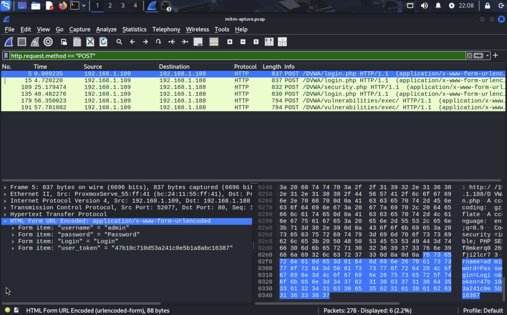

## 🛡️ Attack Simulation 8: Man-in-the-Middle (MITM) via ARP Spoofing + Credential Interception

In this simulation, I successfully performed a **Man-in-the-Middle (MITM)** attack using **ARP spoofing** on a network hosting a vulnerable DVWA server. The objective was to intercept sensitive information such as login credentials by placing myself (the attacker) between a legitimate user (victim) and the web application (target). I achieved this using `arpspoof`, `tcpdump`, and Wireshark.

---

### 🔍 What is a Man-in-the-Middle (MITM) Attack?

A **Man-in-the-Middle (MITM)** attack is a technique where an attacker secretly intercepts and possibly alters communication between two parties without their knowledge. The attacker acts as a **"proxy"**, relaying traffic between the victim and the legitimate destination.

In a **typical LAN-based MITM**, this is achieved using **ARP spoofing**.

---

### 🧠 Understanding ARP Spoofing

- **ARP (Address Resolution Protocol)** maps IP addresses to MAC addresses on a LAN.
- Devices broadcast requests like: "Who has IP 192.168.1.1?"
- The correct device replies with its MAC address.

❗ **ARP spoofing** sends fake ARP replies:
- The attacker pretends to be the **router** to the victim.
- The attacker also pretends to be the **victim** to the router.
- This causes traffic to **pass through the attacker**, allowing interception or manipulation.

---

### 💻 Lab Setup

| Role        | Machine          | IP Address        |
|-------------|------------------|-------------------|
| Attacker    | Kali Linux       | `192.168.1.30`    |
| Victim      | Windows 10       | `192.168.1.109`   |
| Web Server  | Ubuntu (DVWA)    | `192.168.1.188`   |

The victim accesses DVWA hosted on the Ubuntu server. The attacker sits silently on the same network.

---

### 🛠️ Tools Used

- **arpspoof** – Sends fake ARP replies to poison victim/router cache.
- **tcpdump** – Captures network packets silently.
- **Wireshark** – GUI tool to analyze `.pcap` capture files.
- **DVWA** – Vulnerable web app to simulate credential capture.

---

### 🔁 Step-by-Step Attack Process

#### 🧩 Step 1: Enable Packet Forwarding on Attacker (Kali)

To allow the attacker to forward packets between the victim and server (acting like a router):

```bash
sudo sysctl -w net.ipv4.ip_forward=1
```

✅ Output:
```
net.ipv4.ip_forward = 1
```


*Figure 1: Enabling IP Forwarding*

This ensures the attacker does not break the connection between victim and server.

---

#### 🎯 Step 2: Start ARP Spoofing (Victim ↔️ Server)

Using `arpspoof`, I ran **two separate spoofing sessions**:

##### 1️⃣ Spoof Victim (Windows) into thinking attacker is the server:

```bash
arpspoof -i eth0 -t 192.168.1.109 192.168.1.188
```

##### 2️⃣ Spoof Server (Ubuntu) into thinking attacker is the victim:

```bash
arpspoof -i eth0 -t 192.168.1.188 192.168.1.109
```

This poisons both ARP tables and puts me in the middle of their communication.

---

#### 📥 Step 3: Capture Traffic Using tcpdump

While the victim browsed DVWA and attempted login:

```bash
sudo tcpdump -i eth0 -w mitm-capture.pcap
```

This saved the packet stream to a file `mitm-capture.pcap` for offline analysis.

✅ Tip: `tcpdump` silently captures all packets; use `Ctrl+C` to stop when enough is captured.

---

#### 📊 Step 4: Analyze Captured Data in Wireshark

I opened the `.pcap` file in **Wireshark** and used protocol filters to inspect HTTP logins.



*Figure 2: Credentials*


This proves that the attacker can **steal login credentials** using ARP spoofing in plaintext traffic.

---

### 🧪 Demonstration Summary

| Step | Tool | Command/Action | Outcome |
|------|------|----------------|---------|
| 1 | `sysctl` | Enable IP forwarding | Forwarding enabled |
| 2 | `arpspoof` | Poison ARP between victim/server | Traffic redirected |
| 3 | `tcpdump` | Capture traffic | Saved packets to `.pcap` |
| 4 | `Wireshark` | Analyze HTTP traffic | Found credentials |

---

### 🔐 Why This Works (And Real-World Risk)

This works **only because**:

- DVWA uses **HTTP (not HTTPS)**, so credentials are visible.
- ARP has **no authentication**, so spoofing is trivial.
- The attacker is on the **same network** as victim and server.

In real-world attacks, MITM allows:

- **Credential theft**
- **Session hijacking (cookie theft)**
- **Malicious file injection**
- **Phishing and redirect attacks**

---

### 🔚 Conclusion

This simulation successfully demonstrated a **realistic LAN-based Man-in-the-Middle (MITM) attack** using ARP spoofing to intercept HTTP login credentials from a vulnerable web app.

Key takeaways:

- ARP spoofing is highly effective in poorly segmented networks.
- Traffic interception is silent and hard to detect without monitoring.
- Credentials sent over HTTP can be viewed in plain text.

> ✅ This completes one of the most **critical red team attack simulations** — demonstrating how a network attacker can gain sensitive access without exploiting server-side vulnerabilities.