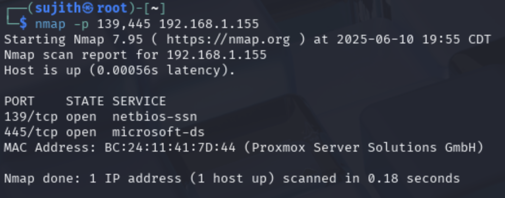
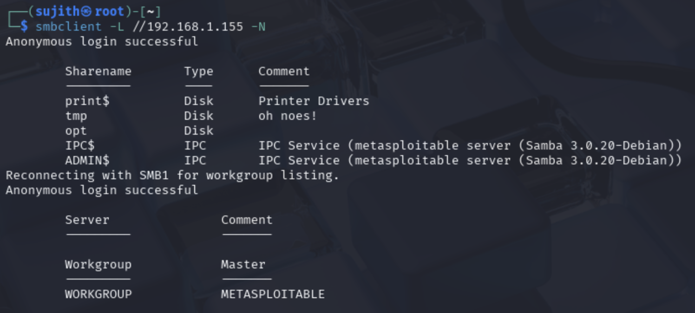
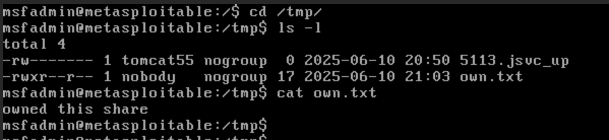

## Attack Simulation 7: SMB Enumeration and Exploitation via Anonymous Access

In this simulation, I targeted a vulnerable host (Metasploitable2) to demonstrate **SMB enumeration and exploitation via unauthenticated access**. The objective was to identify exposed SMB shares and validate whether any of them allowed **anonymous access** or even **write privileges**, which can be critical in real-world red team scenarios.

---

### 💡 What is SMB?

**SMB (Server Message Block)** is a protocol used for **network file sharing**, primarily in Windows environments. It allows users to access files, printers, and other shared resources across a network. On Linux, **Samba** implements the SMB protocol.

Misconfigurations in SMB services — like allowing anonymous access or writable shares — are serious vulnerabilities. Attackers can exploit these to:
- Access sensitive files
- Upload malicious content
- Pivot into internal systems

---

### 🔎 What is SMB Enumeration?

**SMB enumeration** is the process of gathering data from SMB services. This includes:

- Listing shared folders (called "shares")
- Checking read/write permissions
- Identifying user accounts or configurations

It's one of the first recon techniques used during internal penetration tests or red team engagements. The goal is to find shares that expose data or can be abused.

---

### 🔧 What is `smbclient`?

`smbclient` is a command-line utility provided by **Samba**, a suite of tools that implements the SMB protocol on Linux systems.

You can think of `smbclient` as being like **FTP or SFTP**, but for SMB. It allows users to:

- List shared folders (shares) on a remote SMB server
- Connect to those shares interactively
- Download (`get`) and upload (`put`) files
- Navigate directories on the remote SMB server

---

### 🎯 Why Did I Use It?

I used `smbclient` in this simulation to:

- Discover available SMB shares on the target
- Attempt to connect without credentials (anonymous login)
- Test if any shares were **writable**
- Upload a file to demonstrate real exploitation

The ability to interact with SMB shares from the command line makes `smbclient` perfect for red teamers and penetration testers conducting **internal network assessments**.

---

### ⚠️ Why It's Important in Security Testing

`smbclient` is a simple but powerful tool for identifying misconfigurations in file sharing services. In real-world attacks, threat actors use it to:

- Discover sensitive files exposed on internal shares
- Upload backdoors or malicious scripts
- Check if shares are writable to stage further attacks

If a share is world-writable **and accessible without authentication**, it's a high-risk vulnerability that should be remediated immediately.

### 🧰 Environment Setup

- **Attacker machine**: Kali Linux (`192.168.1.30`)
- **Target machine**: Metasploitable2 (`192.168.1.155`)
- Tools used:
  - `nmap`
  - `smbclient`
  - Linux shell commands (`ls`, `put`, `cat`)

---

### 🔍 Step 1: Scanning for SMB Services with Nmap

To begin, I scanned the target for open SMB ports using `nmap`:

```bash
nmap -sV 192.168.1.155
```

- `-sV`: Enables service/version detection

📌 Output:
```
PORT    STATE SERVICE     VERSION
139/tcp open  netbios-ssn Samba smbd 3.X (workgroup: WORKGROUP)
445/tcp open  microsoft-ds Samba smbd 3.X (workgroup: WORKGROUP)
```



*Figure 1: nmap result*

✅ This confirmed that **SMB is active** on the target. Ports `139` and `445` are standard for file sharing. I proceeded to enumerate shares hosted by the Samba server.

---

### 📂 Step 2: Listing SMB Shares with Anonymous Login

I used `smbclient` to check whether the server allowed anonymous access:

```bash
smbclient -L //192.168.1.155 -N
```

- `-L`: List shares on the target
- `-N`: Skip password prompt (attempt anonymous login)

This lists all available SMB shares on the target (`192.168.1.155`) without prompting for a password.

If a share is accessible, I can connect to it:

📌 Output:
```
Sharename       Type    Comment
---------       ----    -------
print$          Disk    Printer Drivers
tmp             Disk    oh noes!
opt             Disk    
IPC$            IPC     IPC Service
ADMIN$          IPC     IPC Service
```



*Figure 2: smbclient*

✅ **Anonymous access was allowed**, and several shares were listed. The share named `tmp` stood out — temporary folders are often world-writable, which makes them a potential attack vector.

---

### ✍️ Step 3: Uploading a File (Exploitation)

To check if the share was writable, I created a test file on Kali:

```bash
echo "Owned this share!" > own.txt
```

Then, I uploaded it via `smbclient`:

```bash
put own.txt
```


*Figure 2: File Creation*

✅ The file uploaded successfully, proving that **unauthenticated users can write files** to the target system.

---

### 📥 Step 4: Accessing the `tmp` Share

To explore the share, I connected directly using:

```bash
smbclient //192.168.1.155/tmp -N
```

This opened an interactive SMB shell:

```bash
smb: \> ls
```


*Figure 4: tmp directory*

✅ The command successfully listed files, confirming **read access**. I tested for write access next.

---


### 🧪 Step 5: Verifying on the Target System

To confirm the exploitation, I logged into Metasploitable2 and navigated to the `/tmp` directory:

```bash
cd /tmp
ls -l
cat own.txt
```

📌 Output:
```
Owned this share!
```



*Figure 4: Metasploitable2 machine*

✅ This verified that the file persisted on the system. **Write access over SMB was successfully exploited.**

---

### 🚨 Why This Matters

Writable SMB shares accessible anonymously are a serious vulnerability:

- An attacker could upload a **malicious script or reverse shell**.
- The file could be executed locally or chained with other vulnerabilities.
- The system’s integrity and confidentiality are at risk.

This is how real intrusions often begin — with a small foothold in a misconfigured internal service.

---

### ✅ Recap of Commands Used

| Step | Command | Purpose |
|------|---------|---------|
| Port Scan | `nmap -sV 192.168.1.155` | Discover SMB services |
| List Shares | `smbclient -L //192.168.1.155 -N` | List available SMB shares via anonymous login |
| Access Share | `smbclient //192.168.1.155/tmp -N` | Connect to a specific share |
| List Files | `ls` | View files in the share |
| Upload File | `put own.txt` | Upload file to test write access |
| Verify File | `cat /tmp/own.txt` | Confirm presence on server |

---

### 🧠 Final Thoughts

This simulation demonstrates a realistic and effective red team attack technique. Many internal networks still rely on legacy services like SMB. If left misconfigured, even unauthenticated attackers can:

- Drop payloads
- Exfiltrate data
- Escalate privileges

In enterprise environments, it’s critical to:

- Disable anonymous access
- Monitor SMB logs
- Restrict share permissions
- Limit lateral movement opportunities

---

✅ **Outcome**: This attack simulation was successful. I discovered, accessed, and exploited an anonymously writable SMB share — exactly the kind of vulnerability real attackers look for during lateral movement and privilege escalation.