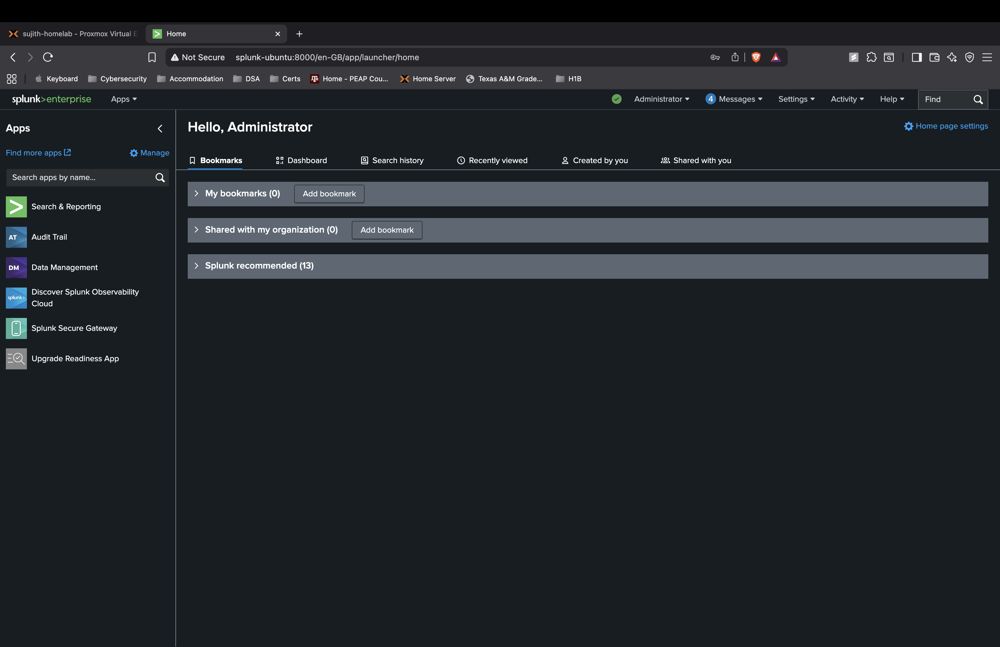

# Splunk Enterprise Setup Guide (Home Lab)

This guide walks through setting up Splunk Enterprise (free trial) on a Linux-based VM, intended for local lab/educational use.
> 🛡️ This setup is just for educational and Documentation purposes. Do not expose to the public internet without proper hardening.

## 📦 Requirements

- Ubuntu 20.04 / 22.04 VM (Proxmox, VirtualBox, etc.)
- Minimum 2 CPU cores, 4GB RAM, 20GB storage
- Internet connectivity

## 1️⃣ Initial VM Setup

1. Install Ubuntu Server on a new VM.
2. Once installation is complete, log in to the VM console.
3. Update the system:

```bash
sudo apt update && sudo apt upgrade -y
```

## 2️⃣ Download Splunk Enterprise

1. Go to [Splunk Enterprise Free Trial](https://www.splunk.com/en_us/download/splunk-enterprise.html)
2. Register / log in, and choose `.deb` for Linux.
3. Copy the `wget` link (e.g.):

```bash
wget -O splunk-10.0.0.deb "<we-get-a-link-after-signing-up-to-a-plan>"
```

## 3️⃣ Install Splunk

```bash
sudo dpkg -i splunk-10.0.0.deb
```

If dependencies are missing, run:

```bash
sudo apt --fix-broken install
```

## 4️⃣ Start and Enable Splunk

```bash
sudo /opt/splunk/bin/splunk start --accept-license
```

Create admin credentials when prompted.

Enable Splunk to start on boot:

```bash
sudo /opt/splunk/bin/splunk enable boot-start
```

## 5️⃣ Access Splunk Web

Go to your browser and access:

```
http://<VM_IP/Domain_Name>:8000
```

Login with the credentials you created earlier.

