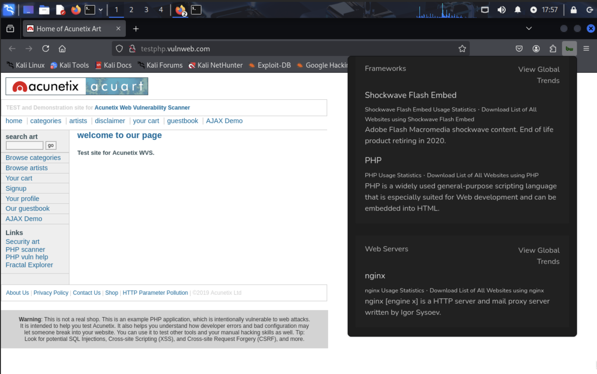

# 2. builtwith – Technology Profiler

**BuiltWith** is an online tool and browser extension used for **passive reconnaissance**. It analyzes a website and shows what technologies it uses — like CMS platforms, analytics, frameworks, security plugins, and hosting providers.

Unlike command-line tools, `BuiltWith` works via its:
- **Web platform**: https://builtwith.com
- **Browser extension**: available for Chrome, Firefox, Edge

---

## Purpose in Recon

Knowing what tech stack a website is using helps in:

- Identifying potential vulnerabilities (e.g., outdated WordPress, old jQuery)
- Planning targeted attacks (e.g., specific CMS exploits)
- Fingerprinting infrastructure without active scanning

It's especially useful in the **early recon stage**, where you want to avoid alerting security systems.

---

## Features Detected by BuiltWith

Some of the typical components it can reveal:

- CMS (WordPress, Joomla, etc.)
- JavaScript libraries (jQuery, React, Angular)
- Hosting provider (Cloudflare, AWS, etc.)
- Web server (Apache, Nginx)
- Analytics tools (Google Analytics, Hotjar)
- Frameworks (Bootstrap, ASP.NET)
- SSL Certificate issuer
- Security tools (WAFs, CDN services)

---

## How to Use BuiltWith

**Option 1: Web Interface**
1. Go to https://builtwith.com
2. Enter a domain
3. View the results

**Option 2: Browser Extension**
1. Install BuiltWith from the Chrome Web Store or Firefox Add-ons
2. Visit a site and click the extension icon
3. The extension will display the technologies detected

---

## Screenshot

*Figure 1: Builthwith Extension Working*

## Limitations

- It’s a **passive tool** — doesn't work offline or on internal lab sites like DVWA.
- Only works on public, internet-facing domains.
- May not detect backend logic or hidden tech (e.g., backend DBMS, internal APIs).

---

## Summary

BuiltWith is a non-intrusive, passive recon tool perfect for fingerprinting websites at scale. It helps map out the surface area without ever touching the target server with a scanner or script. Use it during early recon to guide deeper analysis with tools like `whatweb`, `wafw00f`, or vulnerability scanners.