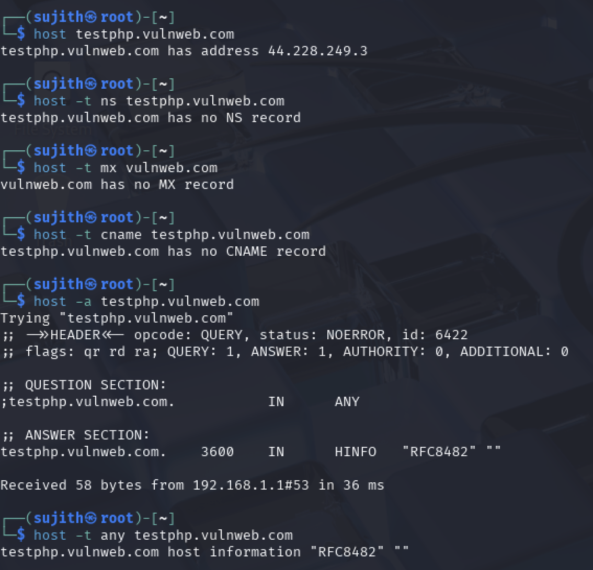

# 1. host – DNS Lookup Tool

The `host` command is a DNS lookup utility that resolves domain names to IP addresses and retrieves other DNS records. It's used to quickly gather basic network-layer information about a target domain during the reconnaissance phase.

## What is DNS?

DNS (Domain Name System) is like the phonebook of the internet. It maps human-readable domain names (like `example.com`) to machine-readable IP addresses (like `93.184.216.34`). Beyond just resolving IPs, DNS also stores other useful records:

- A Record – Maps a domain to an IPv4 address.
- AAAA Record – Maps a domain to an IPv6 address.
- MX Record – Specifies mail servers for handling email for the domain.
- NS Record – Points to the authoritative name servers for the domain.
- CNAME Record – Aliases one domain to another.
- SOA Record – Contains administrative info about the zone.

## Target Domain: testphp.vulnweb.com

This is a public, intentionally vulnerable test site hosted by Acunetix. It is widely used for learning and practicing web application security and reconnaissance.

## 1.1 Resolve the IP Address (A Record)

Command:
```
host testphp.vulnweb.com
```

This command queries the A record and returns the IPv4 address of the domain.

Output:
```
testphp.vulnweb.com has address 44.228.249.3
```

## 1.2 Get Name Server Records (NS)

A **name server** is a DNS server that is responsible for answering queries about a domain, such as resolving domain names to IP addresses. More importantly, name servers store the **DNS zone file**, which contains all DNS records (A, MX, CNAME, etc.) for that domain. These are often referred to as "authoritative name servers" for the domain.

Command:
```
host -t ns vulnweb.com
```

This command retrieves the NS (Name Server) records for the domain. These servers are authoritative and hold the DNS zone file for the domain.

Example Output:
```
vulnweb.com name server ns1.samplenameserver.com.
vulnweb.com name server ns2.samplenameserver.com.
```

## 1.3 Get Mail Server Records (MX)

An **MX (Mail Exchange)** record in DNS tells us **which mail server(s)** are responsible for receiving emails on behalf of the domain. This is how email delivery works behind the scenes.

A **mail server** is a machine that handles incoming email traffic. For example, when someone sends an email to `admin@vulnweb.com`, their email client checks the domain's MX record to know *where to send that message*.

From a pentester's perspective, identifying mail servers can reveal:
- The use of third-party providers (like Gmail, Outlook, or internal mail servers).
- Potential subdomains (e.g. `mail.vulnweb.com`) worth probing.
- Additional IPs or targets for enumeration or attack surface mapping.

Command:
```
host -t mx vulnweb.com
```

This command queries the DNS server for MX records, listing the mail servers for the `vulnweb.com` domain.

Example Output:
```
vulnweb.com mail is handled by 10 mail.vulnweb.com.
```

In this case:
- `10` is the **priority** (lower numbers mean higher priority).
- `mail.vulnweb.com` is the actual mail server.

## 1.4 Check for CNAME Record

A **CNAME (Canonical Name)** record is a type of DNS record that maps one domain name to another. It essentially acts as an alias.

For example:
- If `blog.example.com` has a CNAME record pointing to `medium.example.net`, then anyone visiting `blog.example.com` is transparently redirected to `medium.example.net`.

### Why is this useful?

CNAMEs are often used:
- To point subdomains to external services (e.g. AWS, GitHub Pages, Heroku)
- For load balancing and content delivery networks (CDNs)
- To manage branding and service URLs

As a pentester or recon analyst, CNAME records can reveal:
- Third-party services in use
- Infrastructure hosted elsewhere
- Additional domains you might investigate

Command:
```
host -t cname testphp.vulnweb.com
```

This command checks whether `testphp.vulnweb.com` is an alias for another domain via a CNAME record.

Example Output:
```
testphp.vulnweb.com has no CNAME record
```

This means `testphp.vulnweb.com` directly resolves to an IP address via an A record and is not an alias for another domain.


### 1.5 Retrieve All Records (Where Permitted)

This command attempts to retrieve multiple types of DNS records associated with a domain name, including A, NS, SOA, MX, and others — all in one shot.

This is similar to asking the DNS system:
> "Give me *everything* you know about this domain."

However, not all DNS servers allow full record disclosure. Many modern DNS servers restrict responses to ANY queries to reduce data exposure.

Command:
```
host -a testphp.vulnweb.com
```

Output:
```
Trying "testphp.vulnweb.com"
;; ->>HEADER<<- opcode: QUERY, status: NOERROR, id: 6422
;; flags: qr rd ra; QUERY: 1, ANSWER: 1, AUTHORITY: 0, ADDITIONAL: 0

;; QUESTION SECTION:
;testphp.vulnweb.com.       IN  ANY

;; ANSWER SECTION:
testphp.vulnweb.com.  3600  IN  HINFO  "RFC8482" ""

Received 58 bytes from 192.168.1.1#53 in 36 ms
```

---

### Understanding the DNS Response Header

```
;; ->>HEADER<<- opcode: QUERY, status: NOERROR, id: 6422
;; flags: qr rd ra; QUERY: 1, ANSWER: 1, AUTHORITY: 0, ADDITIONAL: 0
```

- **opcode: QUERY** – This was a standard DNS query.
- **status: NOERROR** – The query was successful; the domain exists.
- **id: 6422** – A random ID used to match the request and response.
- **flags:**
  - **qr** – This is a response, not a request.
  - **rd** – Recursion was requested by the client.
  - **ra** – The server supports recursion.
- **QUERY: 1** – One DNS question was asked.
- **ANSWER: 1** – One DNS answer was returned (HINFO record).
- **AUTHORITY: 0** – No NS records were included.
- **ADDITIONAL: 0** – No extra data like glue records or IPs for name servers.

---

### What Does the HINFO Record Mean?

In this case, the server returned a single record:

```
testphp.vulnweb.com.  3600  IN  HINFO  "RFC8482" ""
```

- **HINFO** – Host Information Record (originally meant to describe CPU and OS).
- **"RFC8482"** – A **placeholder** string, used to deny full `ANY` queries.
- **""** – Second field (CPU info) is empty.

This is a privacy feature defined in **RFC8482**, where DNS servers intentionally return fake or limited info when they receive a broad `ANY` query.

---

### What Kind of Records Might You See (When Permitted)?

If the server allowed full disclosure, you'd expect:

- **A Record** – Maps domain to IPv4.
- **NS Record** – Lists authoritative name servers.
- **MX Record** – Shows email handling servers.
- **SOA Record** – Administrative info about the domain.
- **CNAME** – Points to another domain name.

---

### What Is an SOA Record?

**SOA (Start of Authority)** records are special DNS records that define key information about the domain zone, including:

- The **primary name server** for the domain
- The **email address** of the domain administrator
- The **serial number** (used to track changes to the zone)
- Refresh and retry timings for secondary name servers

An example SOA record might look like this:
```
vulnweb.com. IN SOA ns1.eurodns.com. hostmaster.vulnweb.com. (
    2025060401 ; serial
    3600       ; refresh
    1800       ; retry
    1209600    ; expire
    86400 )    ; minimum
```

This data is useful during recon to identify:
- Domain admin info (in the form of an email)
- How recently DNS changes were made
- Which name server is the "master" authority

---

## Output Screenshot



### Important Note

Some domains or hosting providers intentionally restrict detailed responses to `host -a` or `dig ANY` queries to reduce DNS data leakage. This is expected and not an error — just a form of DNS hardening.

## Summary

- The `host` tool is simple but effective for DNS reconnaissance. It helps identify key infrastructure components early in an engagement, such as IP addresses, mail servers, and authoritative name servers. This information lays the foundation for more detailed enumeration using advanced tools.
- `host -a` internally sends a type `ANY` query.
- Many modern DNS servers no longer return all data for `ANY` queries.
- Instead, they may return minimal info — such as a dummy `HINFO` record with `"RFC8482"`.
- For full recon, it’s better to manually query each record type (A, NS, MX, etc.) using `-t`.