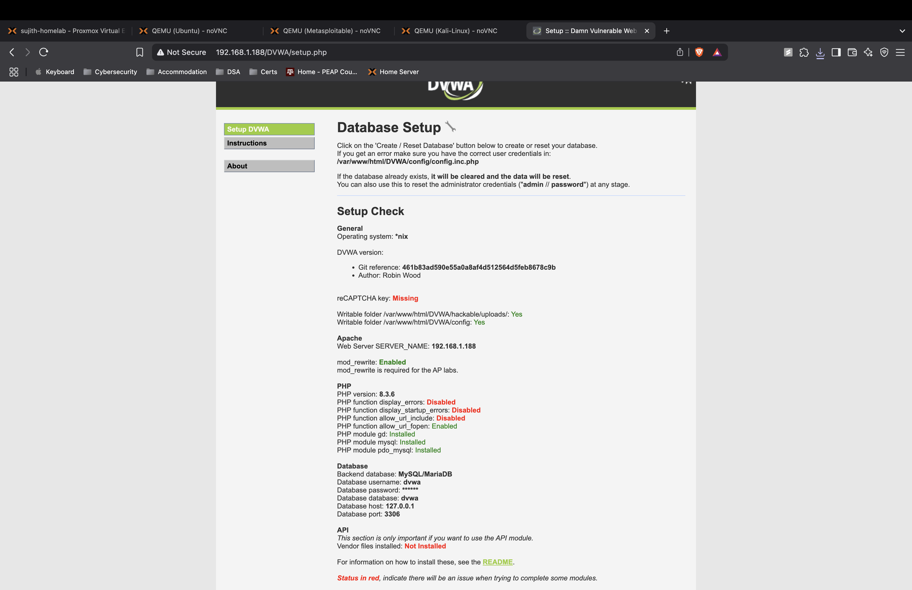

# 🛠️ DVWA Setup on Ubuntu Desktop – Sujith's Cybersecurity Lab

This document provides a comprehensive guide for installing and configuring **Damn Vulnerable Web Application (DVWA)** on **Ubuntu Desktop** in my cybersecurity home lab. DVWA is a vulnerable web application used for practicing red team attack techniques such as SQLi, XSS, brute-force, and more.

---

## 📦 Prerequisites
- Ubuntu Desktop (22.04 LTS or similar), with `sudo` privileges
- An active internet connection for installing packages

---

## 🔍 Step 1: Update and Prepare the System
```bash
sudo apt update && sudo apt upgrade -y
```
This updates the system to the latest packages, ensuring stability and security. A stable base prevents conflicts during DVWA setup and ensures compatibility with Apache, MySQL, and PHP.

---

## 🌐 Step 2: Install and Configure Apache Web Server
```bash
sudo apt install apache2 -y
sudo systemctl start apache2
sudo systemctl enable apache2
```
Apache is the web server that will serve DVWA to the network. After installation, we start the service and configure it to start on boot, ensuring that DVWA remains accessible even after reboots. Testing with `http://localhost` confirms the web server is active.

---

## 🗄️ Step 3: Install MySQL Server and Secure It
```bash
sudo apt install mysql-server -y
sudo mysql_secure_installation
sudo mysql -u root -p
```
MySQL acts as the database backend for DVWA. After installing MySQL, we optionally run the secure installation script to set a root password and remove unsafe defaults. Logging into MySQL prepares us for creating the DVWA-specific database.

---

## 🐘 Step 4: Install PHP and Required Modules
```bash
sudo apt install php libapache2-mod-php php-mysql php-gd php-cli php-curl php-xml php-mbstring -y
sudo systemctl restart apache2
```
PHP is the server-side language DVWA is built on. We install core PHP plus modules essential for database access, image processing, and HTTP interactions. Restarting Apache applies the PHP configuration.

---

## 🌍 Step 5: Download and Set Permissions for DVWA
```bash
cd /var/www/html
sudo git clone https://github.com/digininja/DVWA.git
sudo chown -R www-data:www-data /var/www/html/DVWA
sudo chmod -R 755 /var/www/html/DVWA
```
DVWA is cloned from its official GitHub repository into the Apache web directory. Ownership and permissions are set so Apache can manage the files, ensuring the app functions correctly.

---

## 🗄️ Step 6: Create and Configure the DVWA Database
```bash
sudo mysql -u root -p
```
Inside MySQL:
```sql
CREATE DATABASE dvwa;
CREATE USER 'dvwa'@'localhost' IDENTIFIED BY 'YourStrongPassword123!';
GRANT ALL PRIVILEGES ON dvwa.* TO 'dvwa'@'localhost';
FLUSH PRIVILEGES;
EXIT;
```
Here we create a dedicated database and user for DVWA. This isolates DVWA's data, secures access with a strong password, and follows best practices for web applications.

---

## 📝 Step 7: Configure DVWA's Database Connection
```bash
cd /var/www/html/DVWA/config
sudo cp config.inc.php.dist config.inc.php
sudo nano config.inc.php
```
We copy the default configuration file and edit it to include our database credentials. This connects DVWA to MySQL, allowing it to store and retrieve data.

---

## 🔥 Step 8: Enable Apache's mod_rewrite and Configure Directory Access
```bash
sudo a2enmod rewrite
sudo nano /etc/apache2/apache2.conf
```
Find and edit:
```apache
<Directory /var/www/>
    AllowOverride None
```
Change to:
```apache
    AllowOverride All
```
```bash
sudo systemctl restart apache2
```
The `mod_rewrite` module allows URL rewriting, necessary for certain DVWA functions. Adjusting directory permissions enables `.htaccess` rules to control access and behaviors in the web app.

---

## 🌐 Step 9: Initialize DVWA via the Web Interface
Open a browser and visit:
```
http://<ubuntu-ip>/DVWA/setup.php
```
Here we complete the setup by initializing the database tables and ensuring all system checks pass. This prepares DVWA for practical attack simulations. Once initialized, log in with `admin`/`password` and configure the security level as needed.

---

## 📸 Screenshot (Add your own here)


---

## 🧠 Key Takeaways
DVWA setup involves configuring Apache, MySQL, and PHP to work together, securing the database, and ensuring correct permissions and modules are in place. This creates a vulnerable yet controlled environment for practicing web attacks, crucial for developing red team skills.

---

## 📝 Final Notes
- DVWA is intentionally insecure and should be used only in isolated labs.
- Strong passwords are used even in the lab to simulate real-world practices.
- This setup is foundational for practicing network scanning, enumeration, SQLi, XSS, and brute-force attacks.

---
